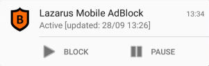

# The Lazarus Android AdBlock

# Overview
The Lazarus Android ad blocker is an app for rooted phones that blocks ads in web browsing sessions within any browser or WebView, as well as in apps.

This brand new design and implementation are based on my extensive experience in creating ad blockers for mobile and I am providing this as a contribution to the community.

Lazarus ad blocker was written from the ground up during the last couple of months in order to provide a baseline for creating a full fledged ad blocker for Android phones. The current version requires root as it is easier to implement, however I plan to also provide one that uses the Android VPN service and runs in user mode.

Blacklists and whitelists are refreshed daily and automatically, so the blocker is never out of sync with the most current ad servers, and URLs.

# Usage
Once installed the ad blocker starts automatically, downloading the blacklists and whitelists from the web. This may take a while, but after all is downloaded it should auto-start.

The ad blocker auto-starts if you boot your phone and is automatically enabled, and provides a way to _*suspend*_, and _*resume*_ the blocker (via notification icon) if you encounter a website or app that are malfunctioning due to blocking.

    

Note that ads over SSL connections are only blocked based on their domain while non-SSL ones are blocked using various URL patterns on top of blacklisted domains.

Also note that looking up the apps network usage it may seem that the ad blocker is consuming huge amounts of data. That is incorrect. As the blocker is the only app that actually goes out to the network (being a proxy) what you are seeing is the aggregation of all apps' traffic.
The apps themselves do not use the air interface as they are proxied through the ad blocker.

# Build
Use Android Studio with the appropriate SDK versions.

# APK Install
Either build from scratch or use the [provided pre-built APK](https://github.com/doronsadeh/android-adblock/blob/master/bin/lazarus.apk?raw=true) (use 'Save Link As' to download it). Remeber to enable _Unknown Sources_ in your Android app settings to allow the APK to be installed after download.

Enjoy and fork, it's free.

Doron Sadeh.

